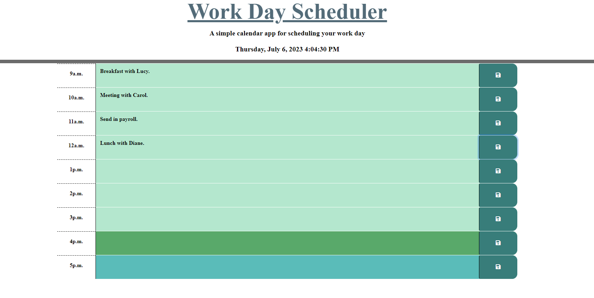

# Workin-Life-Away
A work day planner for your work day needs

## Description
* This work day planner allows you to type in events within the corresponding hour box between the hours of 9am to 5pm.
* All event information is saved into localStorage.
* Past hours are a sea foam color, the current hour is darker green, and the future hours are a turquoise/teal.

## Screenshot of page

## Link to page

## Installation
N/A

## Usage
* Add description of your event ot the text box and click save. Saved events will repopulate upon screen refresh. Past hours are a sea foam color, the current hour is darker green, and the future hours are a turquoise/teal

## Credits
I am not the original creator of the CSS and HTML used on the application, only the Javascript. The .css and .html files are slightly modified versions of the original files given to me by the MSU Bootcamp curriculum.

https://getbootstrap.com/docs/4.0/layout/grid/

https://api.jquery.com/toggle/

https://day.js.org/

https://www.youtube.com/watch?v=vzGzys3enCE&t=61s

https://www.youtube.com/watch?v=YPU6gOctNvM

https://jquery.com/

## License
Please refer to the License in the repository. 